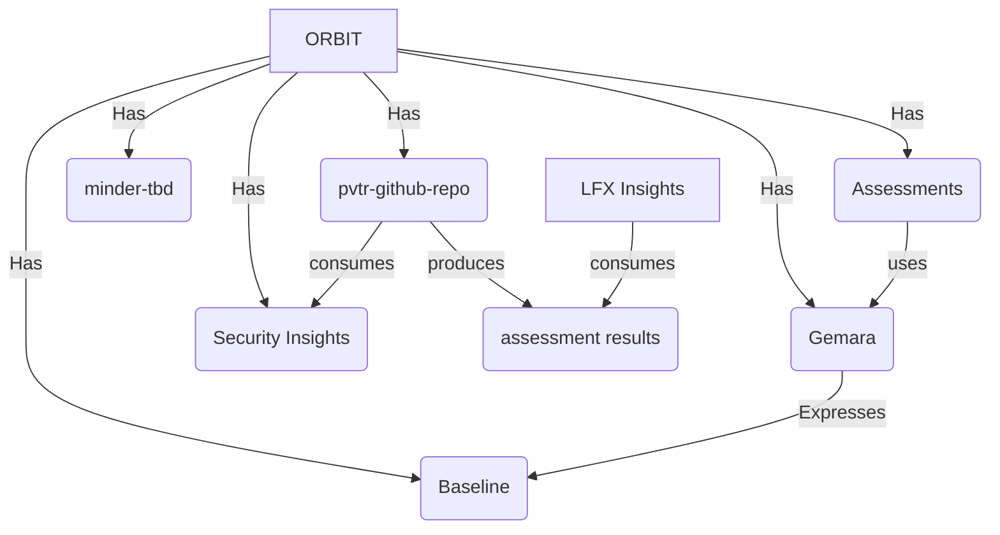

# ORBIT Visual

```mermaid
flowchart TD
    A[ORBIT] -->|Has| B(Baseline)
    A[ORBIT] -->|Has| C(Gemara)
    A[ORBIT] -->|Has| D(Security Insights)
    A[ORBIT] -->|Has| E(pvtr-github-repo)
    A[ORBIT] -->|Has| F(minder-tbd)
    A[ORBIT] -->|Has| G(Assessments)
    C -->|Expresses| B
    E -->|consumes | D
    E -->|produces | H(assessment results)
    G -->|uses | C
    I[LFX Insights] -->|consumes |H
```
