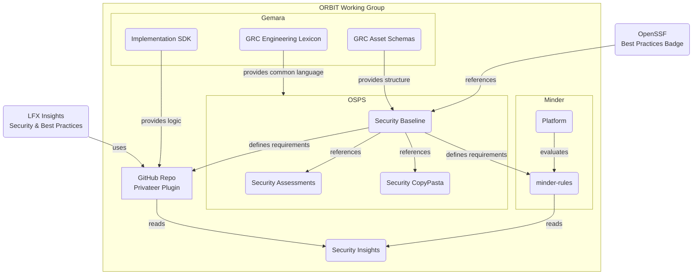

# OpenSSF ORBIT Working Group

**ORBIT**: Open Resources for Baselines, Interoperability, and Tooling

The ORBIT Working Group (WG) is a [Sandbox-level](https://github.com/ossf/tac/blob/main/process/working-group-lifecycle.md#to-become-sandbox) group within the [Open Source Security Foundation (OpenSSF)](https://openssf.org).


ORBIT exists to develop and maintain interoperable resources for the identification and presentation of security-relevant data. It provides a home for collaborative activities, best practice definitions, documentation, testing, integration, and other artifacts supporting the mission.

## Quickstart

If you're looking to adopt ORBIT outputs as a project maintainer, here's a simplified overview of a process you might follow:

1. Set up your project repo(s) with basic [Security Insights](http://security-insights.openssf.org/) documentation
2. Complete the OSPS Baseline [Documentation](https://baseline.openssf.org/versions/2026-02-19.html#documentation) requirements for your project maturity level
3. Complete an [OSPS Self Assessment](https://github.com/ossf/security-assessments) 
  - (Optional: Supplement this with a Gemara-compatible threat assessment)
4. Automate any evaluations you can through [Minder](https://mindersec.dev/) or the [OSPS Baseline Scanner for GitHub Repos](https://github.com/marketplace/actions/open-source-project-security-baseline-scanner)
5. Self-attest to your Baseline conformance with the [OpenSSF Best Practices Badge](https://www.bestpractices.dev/)```

## Initiative Interoperability Overview

---



The group is open to participation from anyone who abides by the [Contributor Covenant Code of Conduct 2.0](https://www.contributor-covenant.org/version/2/0/code_of_conduct/) (OpenSSF member or not).

Review the WG's [mission and scope](CHARTER.md#1-mission-and-scope) for more details.

## Join the Community

1. Star this repository to stay updated
1. Review the [active technical initiatives](./CHARTER.md#active-technical-initiatives) to see where you can contribute
1. Join [Slack](https://openssf.slack.com/archives/C08NJTFAL74) and introduce yourself
1. Join a working group meeting
    - [Add the ORBIT WG meeting to your calendar](https://calendar.google.com/calendar/u/0/r/eventedit/copy/NmxoMTUzc20wbG80MzQxNWY4NGJicHJuMm5fMjAyNTA1MDhUMTcwMDAwWiBzNjN2b2VmaHA1aTlwZmx0YjVxNjduZ3Blc0Bn)
    - [Meeting Notes](https://docs.google.com/document/d/1Hf-SsjYaAvY2Nk_jJ2-aHMqgBi1qg7oIj3PJWsCEe0U/edit?tab=t.0#heading=h.omyjy2x7t74i)

## Governance

The WG is governed by a [Technical Steering Committee (TSC)](./CHARTER.md#2-technical-steering-committee) composed of the leads from the active technical initiatives.

Review the WG charter for information about [operational policies](./CHARTER.md#5-compliance-with-policies), [trademarks](./CHARTER.md#6-community-assets), and [intellectual property licensing](./CHARTER.md#7-intellectual-property-policy).
